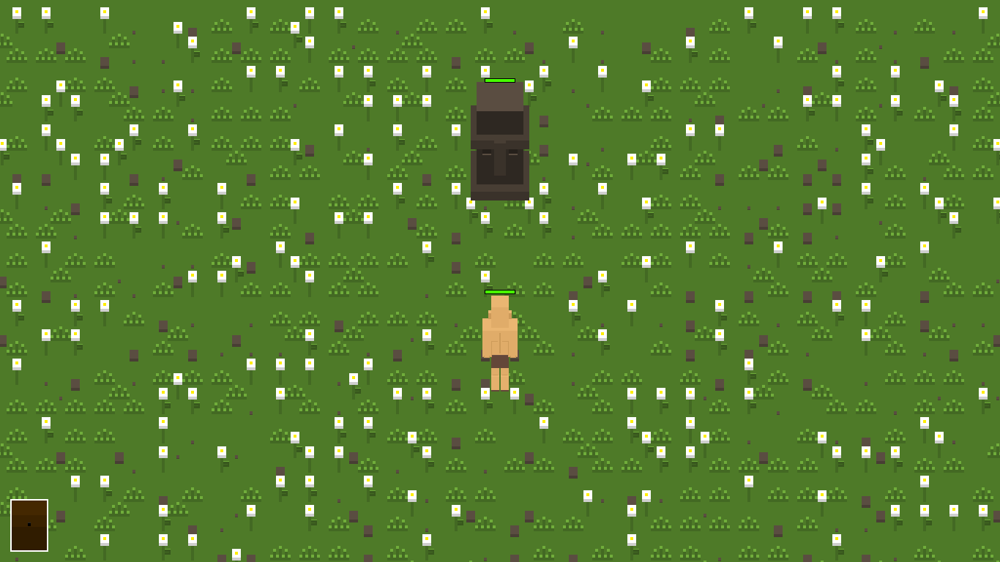
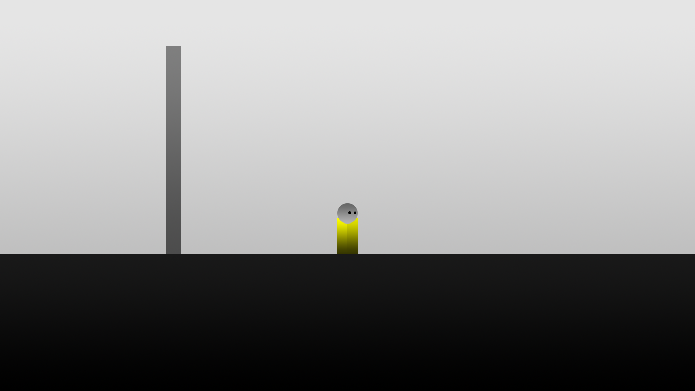
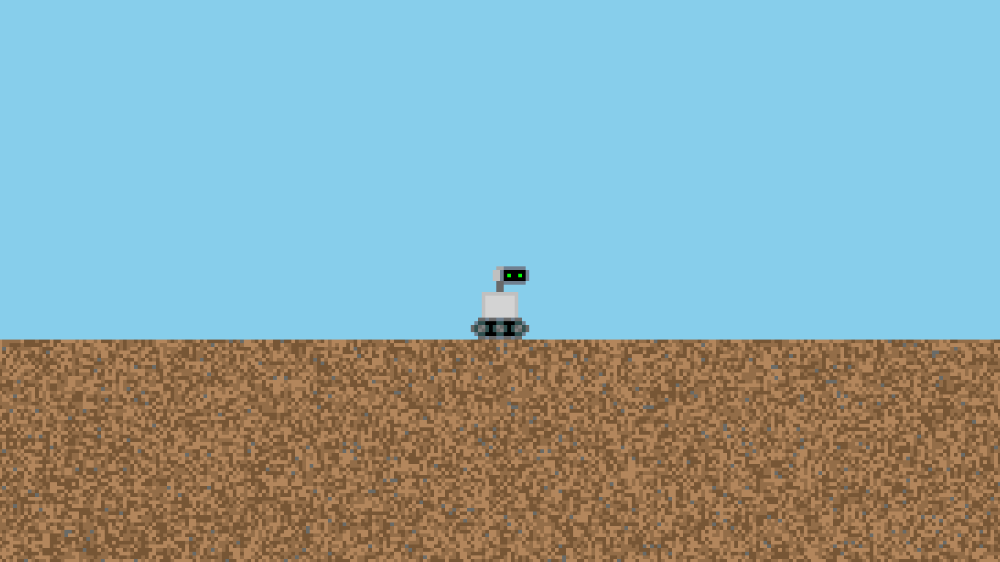
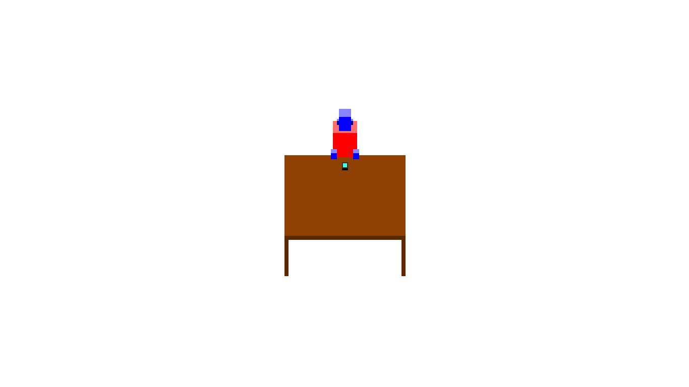

# My Old Pygames

The ideia of this repository is upload games that I created using the Pygame Library, but for some reason I abondonded.

Warning: You'll need python 3 installed to run the games, double clicking Main.py or main.py. If you find a .psd file, use GIMP to open it.

**There's no copyright in these ideas** and you can use them (including the files) to create your own game. Just don't forget to contact me once you done and I'll be glad to play it.

### [Chubby Dragon Chase (CDC)](CDC.zip)
In this game, the player would control a man who has the wife kidnapped by a chubby dragon. So he goes around a dangerous world (where even rocks are enemies) colecting resources and going village to village to ask: 'did you saw the chubby dragon?'. The idea was: every resource comes from enemies. So if want wood, you have to battle against a tree.

A lot of versions. Today I do some objectives to launch a new version of a game (like add some new features, correct bugs). In this project, every day I created a new version. I'll try to upload the latest one.

What have been done: There's a main menu with one menu. When game starts, you're on the map. You can navigate with the W, A, S, D keys. After moving for some direction, a battle against a rock will start. You can defeat it. After that, there's no more content.

### [Project Particles](project_particles.zip)
In this game, the player would control a guy who runs a particle store in space. The ideia was: A client shows up and makes a wish. For example, 2 red and 1 yellow particles. You got 2 reds but not a yellow one, so you have have to combine primary colors (R, G, B) particles to create a new with the color needed.

What have been done: You can interactive with colored circles and combine them at the center of the screen (Like the solution red + green = yellow for the example above).

### [Rainlands](rainlands.zip)
In this game, the player would control a boy who lives on the streets of a city where the rain don't stop. I don't remember further because I didn't make any documentation.

What have been done: You can walk to left and right using A and D keys. Also exit with ESC key.

### [The Space is Out There (TSOT)](TSOT.zip)
In this game, the player would control a robot that falls into a random generated planet. The objective is: refuel the landing module using the resources available to get back to the mother ship.

What have been done: You can walk with your robot using A and D keys. Also brake some dirt blocks using LMB. Use ESC key to exit game.

### The Table Guy
This is not a game at all, just a guy sitting on a table and you can exit with ESC key. The funny part of it is that a made a documentation of this game with a lot of details how it would work. The ideia was: A political RPG where the protagonist starts in your house's kitchen and raises in the political career using fake news, contacts, dirty bribe; until he become the leader of world. You would also make partnership with political groups like progressists, conservatives, etc.

