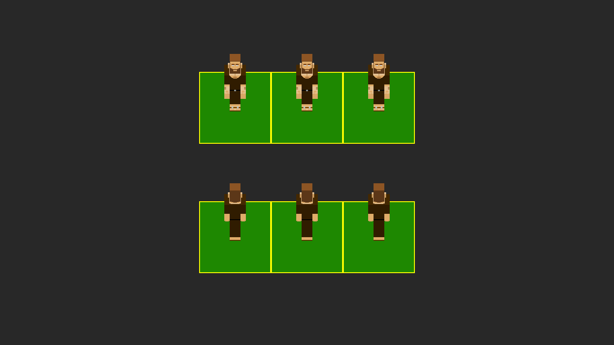
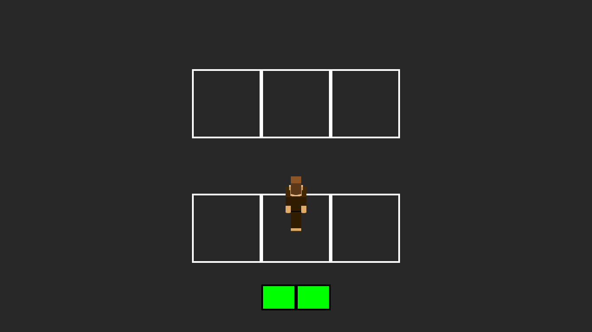

# My Old Pygames

The ideia of this repository is upload games that I created using the Pygame Library, but for some reason I abondonded.

Warning: You'll need python installed to run the games, double clicking Main.py or main.py. If you find a .psd file, use GIMP to open it.

### [The Space is Out There (TSOT)](TSOT.zip)
In this game, the player would control a robot that falls into a random generated planet. The objective is: refuel the landing module using the resources available to get back to the mother ship.

What have been done: You can walk with your robot using A and D keys. Also brake some dirt blocks using LMB. Use ESC key to exit game.

### Chubby Dragon Chase
In this game, the player would control a man who has the wife kidnapped by a chubby dragon. So he goes around a dangerous world (where even rocks are enemies) colecting resources and going village to village to ask: 'did you saw the chubby dragon?'. The idea was: every resource comes from enemies. So if want wood, you have to battle against a tree.

A lot of versions. Today I do some objectives to launch a new version of a game (like add some new features, correct bugs). In this project, every day I created a new version. I'll try to upload each version, pointing the differences between them.

##### Oldest one (0.0d120320)
This is the oldest version I recovered.

##### Action bar? Changes on field (0.0d180320)
The bar above is probably the action bar. Each character would have 2 actions per turn.

